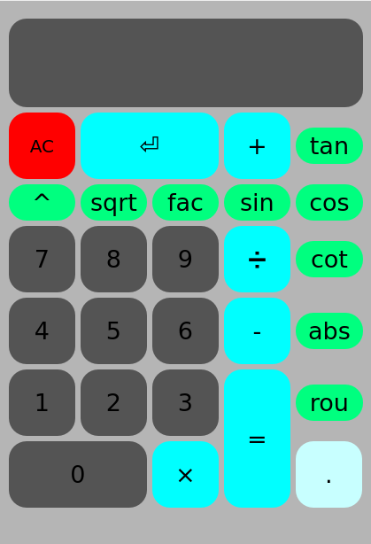
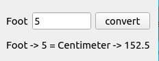

# calculator

## To run this code:
```
pip install pyside2
```
<h4 align="calculator">
  <a href="https://github.com/kiyakeynia8/python_class_NY/blob/main/Assignment%2019/calculator/calculator.py">Click to see the code</a>
  
# convert


## To run this code:
```
pip install pyside2
```
<h4 align="center">
  <a href="https://github.com/kiyakeynia8/python_class_NY/blob/main/Assignment%2019/convert/convert.py">Click to see the code</a>

# tic tac toe


## To run this code:
```
pip install pyside2
```
<h4 align="tic tac toe">
  <a href="https://github.com/kiyakeynia8/python_class_NY/blob/main/Assignment%2019/tic%20tac%20toe/tic_tac_toe_v2.py">Click to see the code</a>
